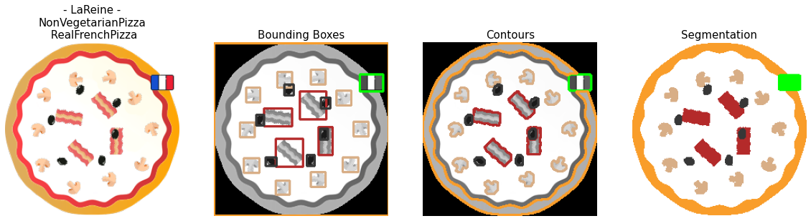

# Pizzaïolo


This python tool can be used to generate a custom dataset of synthetic pizza images with labels and pizza toppings bounding boxes, contours and semantic segmentation, according to the pizzas definitions of an ontology. 

You can find here an example of such a dataset: the [Pizzaïolo Dataset](https://doi.org/10.5281/zenodo.10165941), containing 4800 samples of synthetic pizza images. 


## Authors

Grégory Bourguin<sup>1</sup> & Arnaud Lewandowski<sup>2</sup>  
SysReIC (Systèmes Réflexifs et Ingenierie de la Connaissance)  
[LISIC](https://lisic-prod.univ-littoral.fr/) (Laboratoire Informatique Signal et Image de la Côte d'opale)  
[ULCO](https://www.univ-littoral.fr/) (Université du Littoral Côte d'Opale), FRANCE

<sup>1</sup> gregory.bourguin@univ-littoral.fr  
<sup>2</sup> arnaud.lewandowski@univ-littoral.fr


## Licence

[CC BY-NC 4.0](https://creativecommons.org/licenses/by-nc/4.0/)

If you use Pizzaïolo or the Pizzaïolo Dataset, please cite the following article :

> Bourguin G., Lewandowski A. **Pizzaïolo Dataset : Des Images Synthétiques Ontologiquement Explicables**. 24ème conférence francophone sur l'Extraction et la Gestion des Connaissances, EGC 2024. 


## Requirements 

To use Pizzaïolo, you need to install the following modules:

- Owlready2 [2]
- numpy
- pillow
- pandas
- opencv

## Usage 

You will find in the repository several notebooks that show usages of the tool and that explore the resulting data. 

Basically, here are the steps to generate a dataset:

```py
import owlready2
from libs.pizzaiolo import Pizzaiolo

pizzaiolo = Pizzaiolo()
pizza = pizzaiolo.get_ontology()

pizza_types = [
  pizza.American, 
  pizza.Napoletana,
  pizza.FourSeasons,
  pizza.Mushroom,
  pizza.Veneziana
]

pizzaiolo.cook(pizza_types, number_of_each=10, delivery_dir='output')
```

The generated output is constituted of the following directories: 


- csv/ : 
  - `pizzaiolo_dataset.csv` : details for all the samples in the dataset

- images/ : 
  - pizza images (224*224) : 1 file / sample -> `img_XXXXX.png` <br>
  NB: icons used to generate the images are coming from [https://www.flaticon.com/](https://www.flaticon.com/).

- ontology/ : 
  - `pizzaiolo.xml` : the Pizzaïolo Ontology (OWL) used to generate the samples.<br>
  NB: this ontology was derived from [1], and built/manipulated with [2].

- labels/ : 
  - Concepts Encoding : `concepts.json`
  - Bounding Boxes : 1 file / sample -> `img_XXXXX_bboxes.json`
  - Contours :  1 file / sample ->  `img_XXXXX_contours.json`
  - Semantic Segmentation :  1 file / sample ->  `img_XXXXX_segmentation.txt`

## Generated sample


### Concepts

The concepts are the elements constituting pizzas according to the Pizzaïolo Ontology (i.e. the pizza base, the pizza toppings, and the - optional - country of origin).

The `concepts.json` file contains a Python `dict` for concepts encoding :
- key(s) : a concept id (`uint`)
- value(s) : the concept name (`string`) (i.e. the short name of the concept class in the Pizzaïolo Ontology)

### Bouding Boxes

The bounding boxes represent the localization of the concepts instances constituting a pizza sample.

Each `img_XXXXX_bboxes.json` file contains a Python `dict` :
- key(s) : the name (`string`) of each concept class present in the sample
- value(s) : `list` of all the bouding boxes for the corresponding concept key
  

NB: each bounding box is encoded as a Python (sub)`list` : `[ x_left, y_top, width, height ]`

### Contours

The contours represent the localization and shape of the concepts instances constituting a pizza sample.

Each `img_XXXXX_contours.json` file contains a Python `dict` :
- key(s) : the name (`string`) of each concept class present in the sample
- value(s) : a `list` of all the contours for the corresponding concept key

NB: contours are encoded as [OpenCV Contours](https://docs.opencv.org/4.x/d3/d05/tutorial_py_table_of_contents_contours.html).

### Semantic Segmentation

Each `img_XXXXX_segmentation.txt` file contains a Python Numpy `array` (`dtype=uint`) 
- the shape of the array is the (2D) size of the samples (224*224)
- each "pixel" belongs to a concept encoded according to `concepts.json`.

## References

[1] [Horridge, M. (2011).  Protégé OWL Tutorial | OWL research at the University of Manchester.](http://owl.cs.manchester.ac.uk/publications/talks-and-tutorials/protg-owl-tutorial/).

[2] Lamy, J.-B. (2017).   Owlready : Ontology-oriented programming in Python with automatic classification and high level constructs for biomedical ontologies. Artificial Intelligence in Medicine 80:11–28.


